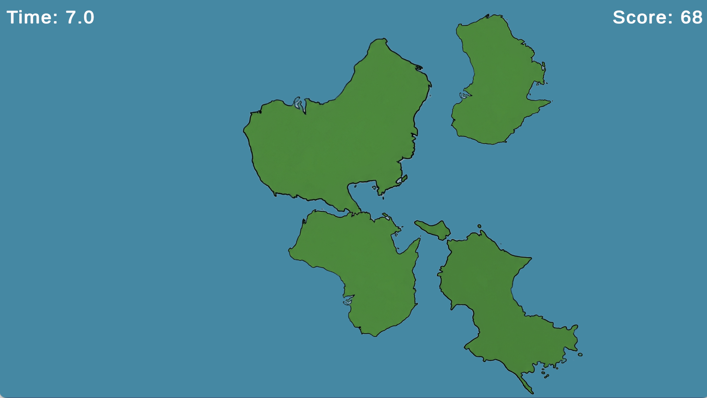

# Shikoku Rush

## 概要

本作は、日本の四国地方がオーストラリアに“なりすまそうとする”というユニークな設定のもと、
プレイヤーが制限時間内に「四国の形」を見つけ続けるカジュアルゲームです。

画面上に表示される複数の地図の中から、四国の形を選択し続けることでスコアが加算されます。
ミスなく正解し続け、ハイスコアの更新を目指します。

## 操作方法

* マウスクリックで四国だと思う図形を選択

## 使用技術

* Unity
* C#

## 工夫した点

* **直感的な操作性**
  図形を直接クリックする仕様にすることで、誰でもすぐに遊べるシンプルな操作性を実現しました。

* **テーマ性のあるゲーム設計**
  「四国とオーストラリアの形が似ている」という着想をもとに、
  視覚的な類似性を活かしたゲームルールを構築しました。

* **難易度の工夫**
  図形をランダムに回転させることで判別を難しくし、
  プレイヤーの観察力を試すゲーム性を強化しました。

## スクリーンショット

## プレイ動画

（ここに動画リンクを追加）
